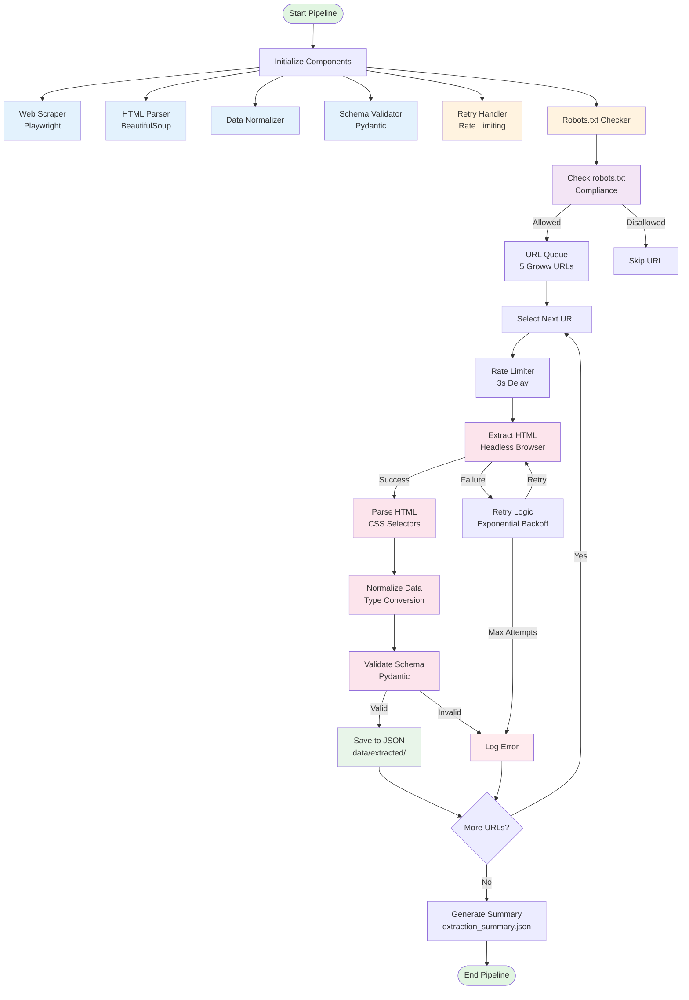

# Phase 1 Implementation: Data Collection & Corpus Preparation

## Overview
This directory contains the complete implementation of Phase 1: Data Collection & Corpus Preparation for the Mutual Fund FAQ Assistant project.

## Implementation Status: ✅ Complete

All sub-phases of Phase 1 have been implemented:
- ✅ 1.1 AMC and Scheme Selection
- ✅ 1.2 Source URL Collection
- ✅ 1.3 Data Extraction Strategy

## Implementation Architecture Diagram



### Module Interaction Flow

```
┌─────────────────────────────────────────────────────────────────┐
│                     Main Pipeline (pipeline.py)                  │
│  ┌──────────────┐  ┌──────────────┐  ┌──────────────┐       │
│  │  URL Queue   │→ │ Robots Check │→ │ Rate Limiter │       │
│  └──────────────┘  └──────────────┘  └──────────────┘       │
│         ↓                 ↓                 ↓                   │
│  ┌──────────────┐  ┌──────────────┐  ┌──────────────┐       │
│  │ Web Scraper  │→ │ HTML Parser  │→ │ Normalizer   │       │
│  │ (Playwright) │  │(BeautifulSoup)│  │              │       │
│  └──────────────┘  └──────────────┘  └──────────────┘       │
│         ↓                 ↓                 ↓                   │
│  ┌──────────────┐  ┌──────────────┐  ┌──────────────┐       │
│  │ Retry Logic  │← │ Validator    │→ │ Save to JSON │       │
│  │ (Tenacity)   │  │ (Pydantic)   │  │              │       │
│  └──────────────┘  └──────────────┘  └──────────────┘       │
└─────────────────────────────────────────────────────────────────┘
```

## Project Structure

```
MutualFund_RAG_FAQ/
├── phases/
│   └── phase1/
│       ├── amc_selection.md              # AMC selection document
│       ├── scheme_selection_matrix.md     # Scheme selection matrix
│       ├── curated_url_list.md           # Curated URL list with metadata
│       ├── url_validation_report.md      # URL validation report
│       ├── data_extraction_methodology.md # Data extraction methodology
│       ├── format_specification.md        # Data format specification
│       └── README.md                      # This file
├── src/
│   ├── __init__.py                       # Package initialization
│   ├── scraper.py                        # Web scraper (Playwright)
│   ├── parser.py                         # HTML parser (BeautifulSoup)
│   ├── normalizer.py                     # Data normalizer
│   ├── validator.py                      # Schema validator (Pydantic)
│   ├── retry.py                          # Rate limiting & retry logic
│   ├── robots_checker.py                 # Robots.txt compliance checker
│   └── pipeline.py                       # Main extraction pipeline
├── data/
│   ├── extracted/                        # Extracted JSON files
│   ├── processed/
│   │   └── chunks/                       # Processed chunks (for Phase 2)
│   └── metadata/                         # Metadata files
├── logs/                                 # Log files
└── requirements.txt                      # Python dependencies
```

## Installation

### Prerequisites
- Python 3.9 or higher
- pip package manager

### Setup Steps

1. **Install dependencies**:
```bash
pip install -r requirements.txt
```

2. **Install Playwright browsers**:
```bash
playwright install chromium
```

3. **Create required directories**:
```bash
mkdir -p data/extracted data/processed/chunks data/metadata logs
```

## Usage

### Running the Extraction Pipeline

Execute the main pipeline script:

```bash
python src/pipeline.py
```

This will:
1. Check robots.txt compliance for all URLs
2. Extract HTML content from the 5 Groww URLs
3. Parse HTML to extract scheme data
4. Normalize and validate the extracted data
5. Save validated data to JSON files in `data/extracted/`
6. Generate an extraction summary report

### Expected Output

After successful execution, you will find:
- Individual JSON files for each scheme in `data/extracted/`
- Extraction summary in `data/extracted/extraction_summary.json`
- Detailed logs in `logs/extraction.log`

## Configuration

### URLs to Extract

The pipeline extracts data from these 5 URLs:
1. https://groww.in/mutual-funds/axis-silver-fof-direct-growth
2. https://groww.in/mutual-funds/axis-small-cap-fund-direct-growth
3. https://groww.in/mutual-funds/axis-flexi-cap-fund-direct-growth
4. https://groww.in/mutual-funds/axis-gold-fund-direct-growth
5. https://groww.in/mutual-funds/axis-nifty-india-defence-index-fund-direct-growth

### Rate Limiting

The pipeline implements:
- Minimum delay of 3 seconds between requests
- Exponential backoff on failures
- Maximum 3 retry attempts per URL

### robots.txt Compliance

The pipeline:
- Checks robots.txt before each request
- Respects crawl-delay if specified
- Uses user agent: "MutualFundFAQBot/1.0 (educational-research)"

## Module Descriptions

### scraper.py
- Uses Playwright for headless browser automation
- Handles JavaScript rendering
- Implements wait logic for dynamic content
- Supports custom CSS selectors

### parser.py
- Parses HTML using BeautifulSoup
- Extracts scheme data using CSS selectors
- Handles multiple selector fallbacks
- Parses numerical data (percentages, floats, integers)

### normalizer.py
- Normalizes text formatting
- Converts data types (string to float/int)
- Standardizes categories and risk levels
- Normalizes dates to ISO 8601 format

### validator.py
- Uses Pydantic for schema validation
- Validates required fields
- Checks data ranges (expense ratio, etc.)
- Validates URL and date formats

### retry.py
- Implements rate limiting
- Provides exponential backoff retry logic
- Decorator for retry operations
- Configurable max attempts and delays

### robots_checker.py
- Checks robots.txt compliance
- Caches robot parsers per domain
- Respects crawl-delay directives
- Fail-safe if robots.txt unavailable

### pipeline.py
- Orchestrates the extraction process
- Coordinates all modules
- Generates summary reports
- Handles errors gracefully

## Data Format

Extracted data follows this structure:

```json
{
  "scheme_info": {
    "scheme_name": "string",
    "scheme_code": "string",
    "amc": "Axis Mutual Fund",
    "category": "string",
    "sub_category": "string",
    "plan_type": "Direct Growth"
  },
  "financial_details": {
    "expense_ratio": "float",
    "exit_load": "string",
    "minimum_investment": "integer",
    "sip_amount": "integer",
    "nav": "float",
    "nav_date": "string (YYYY-MM-DD)"
  },
  "risk_and_returns": {
    "risk_level": "string",
    "benchmark": "string",
    "aum": "float",
    "returns": {
      "1_year": "float (optional)",
      "3_year": "float (optional)",
      "5_year": "float (optional)"
    }
  },
  "fund_management": {
    "fund_manager": "string",
    "fund_manager_experience": "string (optional)"
  },
  "portfolio": {
    "holdings": "array",
    "sector_allocation": "object",
    "asset_allocation": "object"
  },
  "metadata": {
    "source_url": "string",
    "extracted_at": "string (ISO 8601)",
    "extraction_method": "headless_browser",
    "extraction_version": "1.0.0",
    "last_updated": "string (YYYY-MM-DD)"
  }
}
```

## Troubleshooting

### Playwright Installation Issues
If you encounter issues with Playwright:
```bash
playwright install --with-deps chromium
```

### Permission Denied Errors
Ensure you have write permissions for the `data/` and `logs/` directories.

### Rate Limiting Errors
If you encounter rate limiting from Groww:
- Increase the delay in `retry.py` (RateLimiter class)
- Wait before running the pipeline again

### HTML Structure Changes
If scraping fails due to HTML structure changes:
- Update CSS selectors in `parser.py`
- Run the pipeline again

## Next Steps

After Phase 1 completion, proceed to:
- **Phase 2**: Document Ingestion & Processing
  - Chunk the extracted documents
  - Implement data validation
  - Prepare for vector database indexing

## Compliance Notes

- This implementation respects robots.txt
- Rate limiting is implemented to avoid server overload
- User agent identifies the bot as educational research
- No PII is collected or stored
- Data is extracted from public information only

## References

- [PhaseWiseArchitecture.md](../../docs/PhaseWiseArchitecture.md)
- [EdgeCases.md](../../docs/architecture/EdgeCases.md)
- [Data Extraction Methodology](data_extraction_methodology.md)
- [Format Specification](format_specification.md)

---
**Implementation Version**: 1.0.0
**Last Updated**: 2024-05-08
**Status**: Complete and Ready for Use
