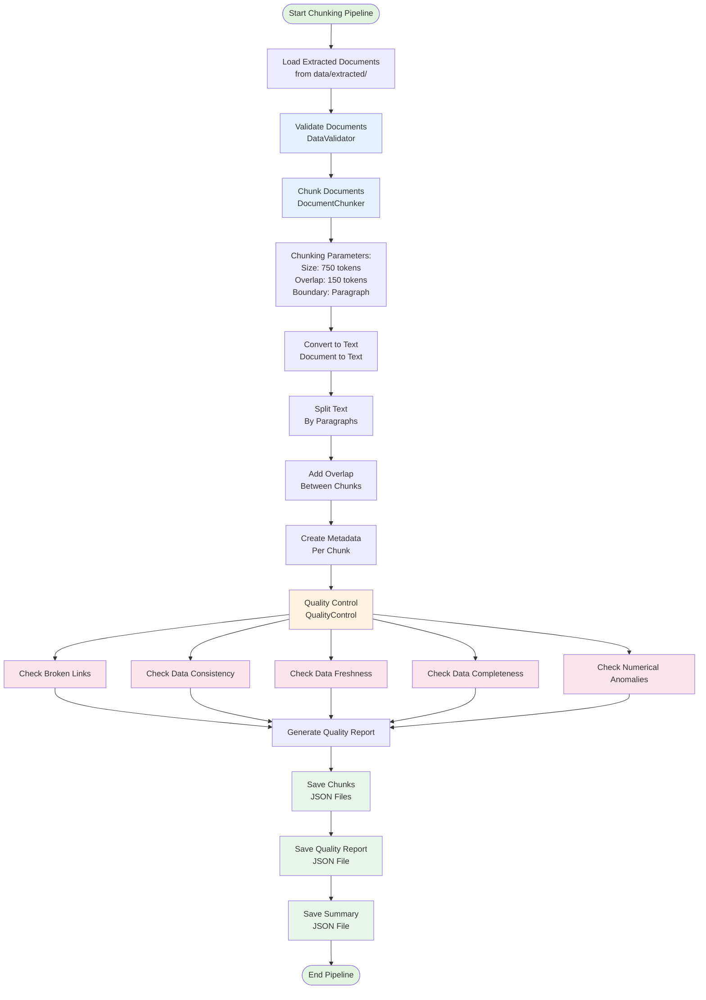

# Phase 2 Implementation: Document Ingestion & Processing

## Overview
This directory contains the complete implementation of Phase 2: Document Ingestion & Processing for the Mutual Fund FAQ Assistant project.

## Implementation Status: ✅ Complete

All sub-phases of Phase 2 have been implemented:
- ✅ 2.1 Content Extraction Pipeline (Completed in Phase 1)
- ✅ 2.2 Document Chunking Strategy
- ✅ 2.3 Data Validation & Quality Control

## Implementation Architecture Diagram



### Module Interaction Flow

```
┌─────────────────────────────────────────────────────────────────┐
│              Chunking Pipeline (chunking_pipeline.py)           │
│  ┌──────────────┐  ┌──────────────┐  ┌──────────────┐       │
│  │ Load Docs    │→ │ Validate     │→ │ Chunk Docs   │       │
│  │ (JSON Files) │  │ (Validator)  │  │ (Chunker)    │       │
│  └──────────────┘  └──────────────┘  └──────────────┘       │
│         ↓                 ↓                 ↓                   │
│  ┌──────────────┐  ┌──────────────┐  ┌──────────────┐       │
│  │ Quality      │→ │ Generate     │→ │ Save Chunks  │       │
│  │ Control      │  │ Reports     │  │ (JSON)       │       │
│  │ (QC Module)  │  │              │  │              │       │
│  └──────────────┘  └──────────────┘  └──────────────┘       │
└─────────────────────────────────────────────────────────────────┘
```

## Project Structure

```
MutualFund_RAG_FAQ/
├── phases/
│   ├── phase1/                          # Phase 1 (Data Collection)
│   └── phase2/                          # Phase 2 (Document Processing)
│       └── README.md                    # This file
├── src/
│   ├── chunker.py                       # Document chunker module
│   ├── data_validator.py                # Data validation module
│   ├── quality_control.py               # Quality control module
│   └── chunking_pipeline.py             # Main chunking pipeline
├── data/
│   ├── extracted/                       # Extracted JSON files (Phase 1 output)
│   └── processed/
│       └── chunks/                      # Chunked documents (Phase 2 output)
│           ├── all_chunks.json
│           ├── {scheme}_chunks.json
│           ├── quality_report.json
│           └── chunking_summary.json
└── logs/
    └── chunking.log                     # Chunking pipeline logs
```

## Installation

### Prerequisites
- Phase 1 must be completed (extracted data available in `data/extracted/`)
- Python 3.9 or higher
- pip package manager

### Setup Steps

1. **Install dependencies** (if not already installed):
```bash
pip install -r requirements.txt
```

2. **Ensure Phase 1 data is available**:
```bash
ls data/extracted/
# Should show 5 JSON files for the schemes
```

3. **Create required directories**:
```bash
mkdir -p data/processed/chunks logs
```

## Usage

### Running the Chunking Pipeline

Execute the chunking pipeline script:

```bash
python src/chunking_pipeline.py
```

This will:
1. Load extracted documents from `data/extracted/`
2. Validate each document for completeness and accuracy
3. Chunk documents into optimal sizes (750 tokens with 150 token overlap)
4. Run quality control checks (links, consistency, freshness, completeness, anomalies)
5. Save chunked documents to `data/processed/chunks/`
6. Generate quality report and summary

### Expected Output

After successful execution, you will find:
- `all_chunks.json` - All chunks combined
- `{scheme}_chunks.json` - Chunks per scheme
- `quality_report.json` - Comprehensive quality control report
- `chunking_summary.json` - Chunking statistics and summary
- Detailed logs in `logs/chunking.log`

## Configuration

### Chunking Parameters

Default chunking parameters:
- **Chunk size**: 750 tokens
- **Overlap**: 150 tokens
- **Boundary**: Paragraph-based

These can be modified in `chunking_pipeline.py`:

```python
pipeline = ChunkingPipeline(
    chunk_size=750,
    overlap=150,
    boundary="paragraph"  # or "sentence", "token"
)
```

### Quality Control Thresholds

Quality control thresholds in `quality_control.py`:
- **Maximum NAV age**: 7 days
- **Expense ratio deviation**: 2%
- **NAV deviation ratio**: 10x

## Module Descriptions

### chunker.py
- Converts documents to text format
- Splits text by paragraphs with boundary preservation
- Adds overlap between chunks
- Attaches metadata to each chunk
- Determines chunk type (general, financial, risk, portfolio)

### data_validator.py
- Validates required fields presence
- Checks numerical data ranges (expense ratio, NAV, etc.)
- Validates date formats (ISO 8601)
- Validates URL formats
- Cross-references facts across documents
- Checks data freshness

### quality_control.py
- Checks for broken links
- Validates data consistency across documents
- Identifies outdated information
- Measures data completeness
- Detects numerical anomalies
- Calculates overall quality score (0-100)

### chunking_pipeline.py
- Orchestrates the chunking process
- Loads extracted documents
- Runs validation and quality checks
- Saves chunked documents
- Generates reports and summaries

## Data Format

### Chunk Format

Each chunk follows this structure:

```json
{
  "chunk_id": "120503_chunk_1",
  "chunk_text": "Scheme Name: Axis Flexi Cap Fund...",
  "chunk_index": 0,
  "chunk_type": "general",
  "metadata": {
    "source_url": "https://groww.in/mutual-funds/...",
    "scheme_name": "Axis Flexi Cap Fund Direct Growth",
    "scheme_code": "120503",
    "category": "Equity",
    "sub_category": "Flexi-cap",
    "document_type": "scheme_details",
    "last_updated": "2024-05-08",
    "chunked_at": "2024-05-08T12:00:00Z",
    "chunking_version": "1.0.0"
  }
}
```

### Quality Report Format

```json
{
  "generated_at": "2024-05-08T12:00:00Z",
  "total_documents": 5,
  "summary": {
    "has_broken_links": false,
    "has_inconsistencies": false,
    "has_outdated_data": false,
    "has_missing_data": false,
    "has_anomalies": false,
    "overall_quality_score": 95.5
  },
  "link_check": {...},
  "consistency_check": {...},
  "freshness_check": {...},
  "completeness_check": {...},
  "anomaly_check": {...}
}
```

## Chunking Strategy

### Boundary Preservation
- **Paragraph-based**: Splits at paragraph boundaries for better context
- **Sentence-based**: Falls back to sentence splitting for long paragraphs
- **Token-based**: Simple word-based splitting as last resort

### Metadata Attachment
Each chunk includes:
- Source URL
- Scheme name and code
- Category and sub-category
- Document type
- Last updated date
- Chunking timestamp
- Chunking version

### Chunk Types
- **general**: General scheme information
- **financial**: Financial details (expense ratio, NAV, etc.)
- **risk**: Risk and returns information
- **portfolio**: Portfolio and holdings

## Quality Control Checks

### 1. Link Validation
- Checks if source URLs are accessible
- Identifies broken (404) and unreachable URLs
- Reports status codes and errors

### 2. Data Consistency
- Validates AMC consistency across documents
- Checks plan type consistency
- Identifies duplicate scheme codes/names
- Generates consistency statistics

### 3. Data Freshness
- Checks NAV date recency (default: 7 days)
- Identifies outdated schemes
- Reports missing NAV dates

### 4. Data Completeness
- Measures field completeness percentage
- Identifies missing required fields
- Reports completeness per scheme

### 5. Numerical Anomalies
- Detects expense ratio anomalies
- Identifies NAV anomalies
- Flags unusual deviations from averages

## Troubleshooting

### No Documents Found
If no documents are found to process:
- Ensure Phase 1 extraction was completed
- Check that JSON files exist in `data/extracted/`
- Verify file permissions

### Chunking Errors
If chunking fails:
- Check document format matches schema
- Verify required fields are present
- Review logs in `logs/chunking.log`

### Quality Score Low
If quality score is low:
- Review quality report for specific issues
- Address broken links or outdated data
- Fix missing or inconsistent fields

### Memory Issues
If processing large documents:
- Reduce chunk size
- Process documents individually
- Increase system memory

## Validation Results

### Validation Report
Each document gets a validation report with:
- Overall validity status
- List of errors (blocking issues)
- List of warnings (non-blocking issues)
- Per-section validation results

### Common Validation Errors
- Missing required fields
- Invalid data types
- Out-of-range values
- Invalid date formats
- Invalid URL formats

## Next Steps

After Phase 2 completion, proceed to:
- **Phase 3**: Vector Database Setup
  - Select embedding model
  - Configure vector database
  - Index chunked documents

## Integration with Phase 1

Phase 2 depends on Phase 1 output:
- Input: Extracted JSON files from `data/extracted/`
- Output: Chunked JSON files in `data/processed/chunks/`

Phase 1 must be completed before running Phase 2.

## Performance Metrics

Expected performance:
- **Processing time**: ~2-5 seconds per document
- **Chunks per document**: 5-15 chunks depending on content
- **Quality score**: Target >90 for healthy data

## References

- [PhaseWiseArchitecture.md](../../docs/PhaseWiseArchitecture.md)
- [EdgeCases.md](../../docs/architecture/EdgeCases.md)
- [Phase 1 README](../phase1/README.md)

---
**Implementation Version**: 1.0.0
**Last Updated**: 2024-05-08
**Status**: Complete and Ready for Use
