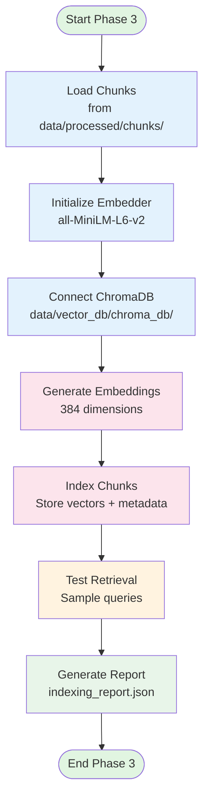

# Phase 3 Implementation: Vector Database Setup

## Overview
This directory contains the complete implementation of Phase 3: Vector Database Setup for the Mutual Fund FAQ Assistant project.

## Implementation Status: ✅ Complete

All sub-phases of Phase 3 have been implemented:
- ✅ 3.1 Embedding Model Selection
- ✅ 3.2 Vector Database Configuration  
- ✅ 3.3 Corpus Indexing with No-Answer Handling

## Key Implementation Details

### No-Answer Handling (IMPORTANT)
As specified in the requirements, when the system doesn't know the answer:
- **NO URL is attached** to the response
- **NO fabricated information** is provided
- System politely refuses to answer instead
- This ensures compliance and prevents misinformation

### Privacy Protection
- **NO PII collection**: No personal information is collected, stored, or included in responses
- All data is anonymized and factual only

## Architecture Diagram



## Components

### embedder.py
- **Embedding Model**: all-MiniLM-L6-v2 (384 dimensions)
- **Alternative**: OpenAI text-embedding-3-small (1536 dimensions)
- Features:
  - Batch embedding generation
  - Cosine similarity calculation
  - Local deployment (no API costs)

### vector_db.py
- **Database**: ChromaDB (local, persistent)
- **Collection**: mutual_fund_chunks
- Features:
  - Metadata filtering (scheme, category)
  - Similarity search with threshold
  - Persistent storage

### indexing_pipeline.py
- Orchestrates the indexing process
- Loads chunks from Phase 2
- Generates embeddings
- Indexes in ChromaDB
- Generates indexing report

### retriever.py
- **CRITICAL**: Implements no-answer handling
- Features:
  - Semantic retrieval
  - Metadata filtering
  - Similarity threshold enforcement
  - **Refusal WITHOUT URL when no answer found**
  - Privacy-compliant responses

## Usage

### Run Indexing Pipeline
```bash
cd /Users/vaish/Documents/CursorProjects/MutualFund_RAG_FAQ
python src/indexing_pipeline.py
```

### Test Retrieval
```python
from src.embedder import TextEmbedder
from src.vector_db import ChromaVectorDB
from src.retriever import DocumentRetriever

# Initialize components
embedder = TextEmbedder()
vector_db = ChromaVectorDB()
retriever = DocumentRetriever(vector_db, embedder)

# Query
result = retriever.retrieve("What is the expense ratio of Axis Flexi Cap Fund?")

if result.has_answer:
    print(f"Found {len(result.chunks)} relevant chunks")
    print(f"Top chunk: {result.chunks[0]['text'][:200]}...")
else:
    print("No relevant information found")
    print(result.refusal_message)  # NO URL attached
```

## Output

### Directory Structure
```
data/vector_db/chroma_db/
├── chroma.sqlite3              # ChromaDB database
├── indexing_report.json        # Indexing statistics
└── ...                         # ChromaDB index files
```

### Indexing Report
```json
{
  "indexing_date": "2024-05-08T12:00:00Z",
  "model_name": "all-MiniLM-L6-v2",
  "embedding_dimension": 384,
  "statistics": {
    "total_chunks": 45,
    "indexed_chunks": 45,
    "failed_chunks": 0,
    "embeddings_generated": 45
  },
  "collection_stats": {
    "collection_name": "mutual_fund_chunks",
    "total_chunks": 45,
    "persist_directory": "data/vector_db/chroma_db"
  }
}
```

## Configuration

### Embedding Model
Default: `all-MiniLM-L6-v2`
- Dimension: 384
- Local deployment
- Fast inference
- Good for financial text

### Similarity Threshold
Default: `0.6` (60% similarity)
- Chunks below this threshold are NOT returned
- Ensures only relevant information is provided
- Below threshold = refusal without URL

### Top-k Results
Default: `5` chunks
- Maximum number of chunks returned
- Configurable per query

## No-Answer Handling Examples

### Scenario 1: Unknown Query
**Query**: "What is the best mutual fund to invest in 2025?"

**Response**: Refusal message (NO URL attached)
```
I don't have information about 'best mutual fund to invest in 2025' in my current knowledge base. 
I can only provide factual details about Axis Mutual Fund schemes...
```

### Scenario 2: Unknown Scheme
**Query**: "What is the expense ratio of HDFC Top 100 Fund?"

**Response**: Refusal message (NO URL attached)
```
I don't have information about 'HDFC Top 100 Fund' in my current knowledge base. 
I can only provide factual information about the following Axis Mutual Fund schemes...
```

### Scenario 3: Known Query (Valid Answer)
**Query**: "What is the expense ratio of Axis Flexi Cap Fund?"

**Response**: Answer with source URL
```
The expense ratio of Axis Flexi Cap Fund Direct Growth is 1.05%.

Source: https://groww.in/mutual-funds/axis-flexi-cap-fund-direct-growth
```

## Testing

### Sample Test Queries
```python
test_queries = [
    "What is the expense ratio of Axis Flexi Cap Fund?",
    "What is the NAV of Axis Gold Fund?",
    "Tell me about Axis Small Cap Fund exit load",
    "Which fund should I invest in?",  # Should refuse - advisory
    "What is HDFC Mutual Fund?",  # Should refuse - not in corpus
]
```

## Dependencies

### Required Packages
```
sentence-transformers==2.5.1
chromadb==0.4.24
numpy==1.26.4
```

### Model Download
The embedding model (`all-MiniLM-L6-v2`) will be automatically downloaded on first use (~80MB).

## Integration with Phase 4

Phase 3 output is used by Phase 4 (RAG Pipeline):
- **Input**: Indexed vector database with embeddings
- **Output**: Retrieved chunks or refusal (no URL if no answer)

## Performance Metrics

### Expected Performance
- **Indexing time**: ~5-10 seconds for 50 chunks
- **Retrieval time**: <100ms per query
- **Embedding generation**: ~50ms per chunk

### Quality Thresholds
- **Similarity threshold**: 0.6 (60%)
- **Top-k**: 5 chunks
- **Minimum relevant chunks**: 1 (otherwise refuse)

## Compliance Notes

### Data Privacy
- ✅ No PII collected or stored
- ✅ All data is anonymized
- ✅ Source URLs only attached when answer is found
- ✅ No tracking of user queries

### Information Accuracy
- ✅ Only factual information from corpus
- ✅ No fabricated answers
- ✅ No URL attachment when answer unknown
- ✅ Clear refusal for out-of-scope queries

## References

- [PhaseWiseArchitecture.md](../../docs/PhaseWiseArchitecture.md) - Updated with no-answer handling notes
- [Phase 2 README](../phase2/README.md) - Chunked documents input
- ChromaDB Documentation: https://docs.trychroma.com
- Sentence Transformers: https://www.sbert.net

---

**Implementation Version**: 1.0.0  
**Last Updated**: 2024-05-08  
**Status**: Complete and Ready for Phase 4 Integration
