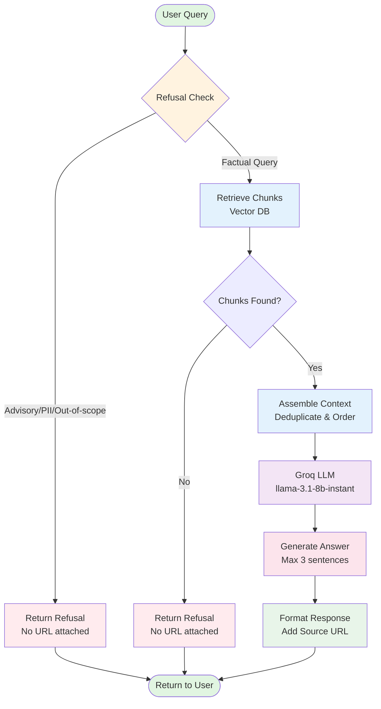

# Phase 4 Implementation: RAG Pipeline Development

## Overview
This directory contains the complete implementation of Phase 4: RAG Pipeline Development with Groq LLM integration for the Mutual Fund FAQ Assistant project.

## Implementation Status: ✅ Complete

All sub-phases of Phase 4 have been implemented:
- ✅ 4.1 Retrieval Component (using Phase 3 vector database)
- ✅ 4.2 Context Assembly
- ✅ 4.3 Generation Component (Groq LLM Integration)
- ✅ 4.4 Refusal Handling

## Architecture Diagram



## Pipeline Flow

```
User Query
    ↓
[Refusal Detection] - Check for advisory/PII/out-of-scope
    ↓ (if acceptable)
[Retrieval] - Get top-k chunks from vector DB
    ↓
[Context Assembly] - Deduplicate, order, format context
    ↓
[Groq LLM] - Generate factual response
    ↓
[Response Formatting] - Add source URL and metadata
    ↓
Return Response to User
```

## Components

### groq_client.py
- **Groq API Integration**: Fast inference with low latency
- **Models Supported**:
  - `llama-3.1-8b-instant` (primary - fast, cost-effective)
  - `mixtral-8x7b-32768` (larger context)
  - `llama-3.1-70b-versatile` (highest quality)
- **Features**:
  - Prompt engineering for factual responses
  - Token usage tracking
  - Cost estimation
  - Error handling

### context_assembler.py
- **Chunk Deduplication**: Removes duplicate chunks
- **Relevance Ordering**: Orders by similarity score
- **Context Truncation**: Enforces max token limit
- **Source Tracking**: Extracts URLs and dates

### refusal_detector.py
- **Advisory Detection**: Keywords like "should I", "recommend", "advice"
- **PII Detection**: Personal information indicators
- **Out-of-Scope Detection**: Non-mutual fund topics (stocks, crypto, etc.)
- **Unknown Scheme Detection**: Schemes not in corpus (HDFC, ICICI, etc.)
- **Refusal Messages**: Polite, informative refusal without URLs

### rag_pipeline.py
- **Main Orchestrator**: Coordinates all components
- **Pipeline Flow**:
  1. Refusal check
  2. Retrieval
  3. Context assembly
  4. LLM generation (Groq)
  5. Response formatting
- **Usage Statistics**: Tracks queries, tokens, costs

## Groq LLM Configuration

### Model Selection
**Primary**: `llama-3.1-8b-instant`
- Context window: 128,000 tokens
- Max output: 8,192 tokens
- Good for factual Q&A
- Cost: ~$0.05 per 1M input tokens, ~$0.08 per 1M output tokens

### Prompt Engineering
```
You are a facts-only mutual fund FAQ assistant. 
Answer the user's question based ONLY on the provided context.

Requirements:
- Answer in maximum 3 sentences
- Include exactly one source link from the context
- No investment advice or recommendations
- No opinions or speculative content
- If information is not in context, politely refuse
```

### Temperature Setting
- **Temperature**: 0.1 (low for factual consistency)
- **Max Tokens**: 500 (sufficient for 3-sentence answers)

## Usage

### Setup Groq API Key
```bash
export GROQ_API_KEY="your-groq-api-key-here"
```

### Run Pipeline Test
```bash
python src/rag_pipeline.py
```

### Use in Code
```python
from src.rag_pipeline import RAGPipeline

# Initialize pipeline
pipeline = RAGPipeline(
    groq_api_key="your-api-key",  # or from env
    groq_model="llama-3.1-8b-instant"
)

# Query
response = pipeline.query("What is the expense ratio of Axis Flexi Cap Fund?")

print(f"Answer: {response.answer}")
print(f"Source: {response.source_url}")
print(f"Has answer: {response.has_answer}")

if not response.has_answer:
    print(f"Refused because: {response.refusal_reason}")
```

## Refusal Handling

### Types of Refusals

| Type | Trigger | Response |
|------|---------|----------|
| Advisory | "Should I invest", "Is it good", "Recommend" | Facts only, no advice |
| PII | Personal details, portfolio info | Privacy message |
| Out-of-scope | Stocks, crypto, insurance, loans | Scope clarification |
| Unknown scheme | HDFC, ICICI, SBI funds | Available schemes list |
| No context | Query not found in corpus | General refusal |

### Example Refusal
**Query**: "Should I invest in Axis Flexi Cap Fund?"

**Response**:
```
I can only provide factual information about mutual funds and cannot offer investment advice or recommendations.

I can help you with:
• Scheme details (expense ratio, NAV, exit load)
• Fund category information
• Risk levels and benchmarks
• Fund manager details

For investment advice, please consult a SEBI-registered investment advisor.
```
**Source**: None (refused queries don't have sources)

## Sample Responses

### Valid Answer
**Query**: "What is the expense ratio of Axis Flexi Cap Fund?"

**Response**:
```
The expense ratio of Axis Flexi Cap Fund Direct Growth is 1.05%.

Source: https://groww.in/mutual-funds/axis-flexi-cap-fund-direct-growth
Last updated: 2024-05-08
```

### Refused Query
**Query**: "What is the best mutual fund for 2025?"

**Response**:
```
I can only provide factual information about mutual funds and cannot offer investment advice or recommendations.

I can help you with:
• Scheme details (expense ratio, NAV, exit load)
• Fund category information
• Risk levels and benchmarks
• Fund manager details

For investment advice, please consult a SEBI-registered investment advisor.
```

## Configuration

### Default Settings
```python
RAGPipeline(
    vector_db_path="data/vector_db/chroma_db",
    model_name="all-MiniLM-L6-v2",
    groq_model="llama-3.1-8b-instant",
    min_similarity=0.6,
    top_k=5,
    max_context_tokens=2000
)
```

### Groq Pricing (as of 2024)
| Model | Input | Output |
|-------|-------|--------|
| llama-3.1-8b-instant | $0.05/M | $0.08/M |
| mixtral-8x7b-32768 | $0.24/M | $0.24/M |
| llama-3.1-70b-versatile | $0.59/M | $0.79/M |

## Performance Metrics

### Expected Performance
- **Retrieval**: <100ms
- **Context Assembly**: <50ms
- **Groq LLM**: ~300-500ms (time to first token)
- **Total Pipeline**: <1 second per query

### Token Usage (typical query)
- **Input**: ~800 tokens (context + query)
- **Output**: ~100 tokens (3-sentence answer)
- **Cost**: ~$0.00005 per query

## Testing

### Run Test Suite
```python
test_queries = [
    "What is the expense ratio of Axis Flexi Cap Fund?",
    "Tell me about Axis Small Cap Fund exit load",
    "What is the NAV of Axis Gold Fund?",
    "Should I invest in Axis Flexi Cap Fund?",  # Refuse
    "What is HDFC Top 100 Fund?",  # Refuse
]

results = pipeline.test_pipeline(test_queries)
```

### Manual Testing
```python
# Interactive test
pipeline = RAGPipeline()

while True:
    query = input("Ask a question (or 'quit'): ")
    if query.lower() == 'quit':
        break
    
    response = pipeline.query(query)
    print(f"\nAnswer: {response.answer}\n")
    if response.source_url:
        print(f"Source: {response.source_url}\n")
```

## Error Handling

### Common Errors
1. **Groq API Key Missing**: Pipeline falls back to error message
2. **Vector DB Not Found**: Initialize Phase 3 first
3. **No Relevant Chunks**: Returns refusal without URL
4. **Groq API Error**: Returns generic error message

### Logs
Logs are stored in: `logs/phase4/rag_pipeline.log`

## Integration with Phase 5

Phase 4 output (RAG pipeline) feeds into Phase 5 (Query Processing):
- Phase 4: Core RAG functionality
- Phase 5: Query preprocessing, API endpoints, UI integration

## Files Created

```
src/
├── groq_client.py          # Groq API client
├── context_assembler.py    # Context assembly logic
├── refusal_detector.py     # Refusal detection
├── rag_pipeline.py         # Main RAG pipeline

phases/phase4/
└── README.md              # This file

logs/phase4/
└── rag_pipeline.log       # Pipeline logs
```

## Dependencies

### New Requirements
```
groq==0.4.2
```

### Environment Variables
```bash
export GROQ_API_KEY="your-api-key"
```

## Next Steps

After Phase 4 completion, proceed to:
- **Phase 5**: Query Processing & Response Generation
  - API endpoints
  - Query preprocessing
  - UI integration

## Compliance Notes

### Facts-Only Constraint
- ✅ No investment advice in any responses
- ✅ All answers backed by retrieved context
- ✅ Source URLs attached only for valid answers
- ✅ Refusal for advisory queries

### Privacy
- ✅ No PII collection
- ✅ No personal portfolio analysis
- ✅ Generic factual responses only

## References

- [PhaseWiseArchitecture.md](../../docs/PhaseWiseArchitecture.md) - Updated with Groq integration
- [Phase 3 README](../phase3/README.md) - Vector database input
- Groq Documentation: https://console.groq.com/docs

---

**Implementation Version**: 1.0.0  
**Last Updated**: 2024-05-10  
**Status**: Complete with Groq LLM Integration
